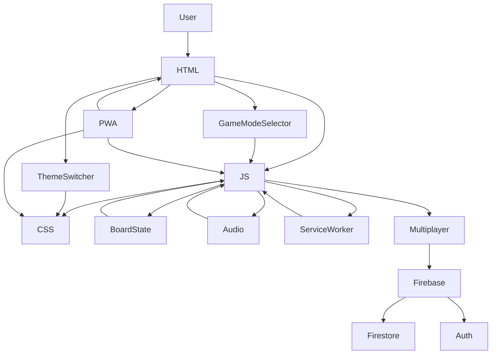

# X³O³ (Rotating Tic-Tac-Toe) — Codebase Overview (2025-06-06)

## Product & Vision

**X³O³** is a cyberpunk-themed, rotating Tic-Tac-Toe game for web and PWA, now featuring robust online multiplayer via Firebase. The game is designed for casual and competitive play, with unique mechanics (rotating marks, multiple modes), a visually striking UI, and seamless online/offline experiences. The product vision is to deliver a modern, accessible, and extensible twist on a classic game, playable solo, locally, or online.

---

## Architecture Overview

### High-Level Structure



### Multiplayer System (Firebase)

```mermaid
sequenceDiagram
    participant Player1
    participant Player2
    participant Firestore
    Player1->>Firestore: createLobby(mode)
    Player1-->>Player1: Receives lobby code
    Player2->>Firestore: joinLobby(code)
    Firestore-->>Player2: Lobby data (mode, status)
    Player1-&gt;&gt;Firestore: listenToGame(code)
    Player2-&gt;&gt;Firestore: listenToGame(code)
    loop Each Move
        PlayerX->>Firestore: makeMove(code, idx, value)
        Firestore-->>Player1: Updated game state
        Firestore-->>Player2: Updated game state
    end
```

---

## Key Components

### 1. index.html
- Splash page for mode/theme selection, multiplayer UI, game board, status, and PWA meta.
- Loads `style.css`, `script.js`, `multiplayer.js`, and Firebase SDKs.

### 2. style.css
- Neon cyberpunk and high-contrast themes via CSS variables.
- Responsive grid, touch-friendly, accessible.
- Styles for splash, multiplayer, and PWA cues.

### 3. script.js
- **Game Logic:** Board state, move history, win/draw logic, rotation, and UI updates.
- **Audio:** Web Audio API and fallback for sound effects.
- **Theme/Mode:** Switching and persistence.
- **PWA:** Service worker registration, update notification.
- **Multiplayer UI:** Lobby creation/join, real-time sync, event handlers, and integration with `multiplayer.js`.

### 4. multiplayer.js
- **Firebase Integration:**
  - Initializes Firebase app, Firestore, and anonymous auth.
  - Handles lobby creation, joining, and real-time game state sync.
  - Validates moves, enforces turn order, and updates Firestore.
- **Lobby System:**
  - Lobbies are Firestore documents with code, mode, status, and player info.
  - Real-time listeners keep both clients in sync.

### 5. service-worker.js
- Caches static assets and sounds for offline play.
- Bypasses Firestore requests to avoid breaking multiplayer.
- Handles update notifications.

### 6. manifest.json
- PWA manifest: name, icons, theme color, display mode, start URL.

### 7. sounds/
- `x.mp3`, `o.mp3`, `winner.mp3` for in-game audio feedback.

---

## Multiplayer Flow (Firebase)

```mermaid
flowchart TD
    Player1 -- createLobby(mode) --> Firestore
    Player1 <-- lobby code -- Firestore
    Player2 -- joinLobby(code) --> Firestore
    Firestore -- lobby data --> Player2
    Player1 & Player2 -- listenToGame(code) --> Firestore
    PlayerX -- makeMove(code, idx, value) --> Firestore
    Firestore -- updated state --> Player1
    Firestore -- updated state --> Player2
```

---

## Responsiveness & Accessibility
- CSS grid and media queries for mobile/desktop scaling.
- Large touch targets, accessible color options, and keyboard-friendly controls.
- Theme/mode switchers persist user preference.
- PWA install cues and update notifications are accessible.

---

## Extensibility & Future Work
- Modular JS and CSS for easy feature addition (AI, animations, new themes, etc.).
- PWA/service worker architecture supports future enhancements (push notifications, advanced offline, etc.).
- Firebase structure allows for future features (chat, rematch, player stats).

---

## Current State & Known Issues (2025-06-06)
- **Multiplayer MVP is live:** Players can create/join lobbies, play in real time, and see each other's moves.
- **PWA:** Fully installable, offline support, update notifications.
- **Outstanding Issues:**
  - No universal main menu access from multiplayer UI.
  - Win condition not enforced in multiplayer.
  - No sound effects in multiplayer.
  - Game mode sync issue between host and joiner.
  - See `issues.md` for details and prioritization.

---

## Summary
- **X³O³** is a modern, extensible, and visually unique Tic-Tac-Toe game with advanced multiplayer and PWA support.
- The codebase is modular, maintainable, and ready for future enhancements.
- See `README.md` for setup, and `FIREBASE_SETUP_GUIDE.md` for multiplayer configuration.
